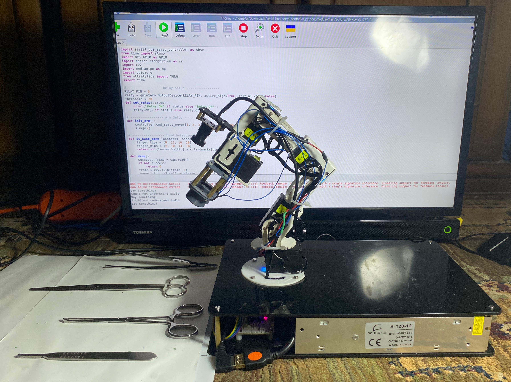

# 🦾 Robotic Arm for Surgical Assistance


A **6-DOF (Degree of Freedom) robotic arm** designed for surgical assistance, developed as a Final Year Project at the **Faculty of Engineering, Alexandria University — Biomedical Engineering Department**.

The arm integrates **YOLOv8 object detection**, **real-time speech recognition**, and **hand gesture control** to allow surgeons to retrieve surgical tools hands-free, improving sterility, efficiency, and precision in the operating room.

---

## 👥 Team

| Name | ID |
|---|---|
| Ahmed Zaineldin | 7337 |
| Omar Yasser | 7437 |
| Khaled Ahmed | 7463 |
| Moustafa Farouk | 7590 |
| Malak Sherif | 7701 |
| Laylan Maged | 7828 |
| Jana Abdellatif | 7659 |
| Mohamed Sherif | 7511 |

**Supervised by:** Dr. Taher Awad · Dr. Mohamed Abdelnaeem · Dr. Mahmoud Omar

---

## 📸 Demo


---

## ✨ Features

- 🎤 **Voice-Controlled Tool Selection** — Surgeons request tools by name; speech recognition identifies the command using Google's Speech Recognition API
- 👁️ **YOLOv8 Object Detection** — Detects and localizes surgical tools (forceps, scalpel, iris scissors, hemostat) in real-time from a live camera feed
- ✋ **Hand Gesture Release** — An open-hand gesture (detected via MediaPipe) triggers the electromagnet to release the tool to the surgeon
- 🤖 **6-DOF Articulated Arm** — CNC-cut iron frame with 5× LX-15D Serial Bus Servos and full kinematics support
- 🧲 **Electromagnetic End Effector** — Dual electromagnets controlled via a relay module for contactless tool pickup and release
- 🔁 **Multithreaded Pipeline** — Vision, speech, and motor control run concurrently for real-time responsiveness

---

## 🛠️ Hardware

| Component | Details |
|---|---|
| Microcontroller | Raspberry Pi 5 (4GB, 2.4GHz Quad-Core Cortex-A76) |
| Servo Motors | 7× LX-15D Serial Bus Servo (15 kg/cm torque, 240° range, real-time feedback) |
| Servo Controller | Hiwonder Serial Bus Servo Controller (STM32 ARM Cortex-M3) |
| Camera | USB Camera Module — 640×480 VGA, 30fps, 130° wide-angle |
| Microphone | ZAFFIRO USB Microphone |
| End Effector | Dual DC5V Electric Lifting Magnets (2.5–3 kg holding force each) |
| Relay Module | 5V Single-Channel Relay with Optocoupler Isolation |
| Power Supply | 12V 10A Switching Power Supply |
| Step-Down Converter | XL4016 DC-DC Buck Converter (12V → 7.4V for servos) |
| Structure | CNC-cut iron frame (L1=8cm, L2=8cm, L3=10cm) |
| Electronics Base | Acrylic enclosure housing Raspberry Pi and power components |

---

## 💻 Software & Libraries

```
Python 3.x
ultralytics          # YOLOv8 object detection
opencv-python        # Video capture and frame processing
mediapipe            # Real-time hand landmark detection
SpeechRecognition    # Google Speech-to-Text
pyaudio              # Microphone audio input
serial_bus_servo_controller  # Hiwonder servo communication (UART)
gpiozero             # Raspberry Pi GPIO / relay control
RPi.GPIO
```

---

## 🧠 How It Works

```
Surgeon speaks tool name (e.g. "forceps")
            │
            ▼
   Google Speech Recognition
            │
            ▼
  YOLOv8 detects tool in camera feed
  → calculates X-position of bounding box
            │
            ▼
  X-position mapped to one of 4 workspace zones
  → servo PWM angles selected for that zone
            │
            ▼
  Raspberry Pi sends commands via UART
  → LX-15D servos move arm to tool location
            │
            ▼
  Relay activates electromagnet → picks up tool
  → arm moves to handoff position above surgeon
            │
            ▼
  MediaPipe detects open hand gesture (25 consecutive frames)
  → relay deactivates electromagnet → tool released
            │
            ▼
  Arm returns to home position
```

---

## 🚀 Getting Started

### 1. Clone the Repository

```bash
git clone https://github.com/AhmedZaineldin/Robotic-Arm-with-computer-vision-and-speech-recognition.git
cd Robotic-Arm-with-computer-vision-and-speech-recognition
```

### 2. Install Dependencies

```bash
pip install ultralytics opencv-python mediapipe SpeechRecognition pyaudio gpiozero RPi.GPIO
```

> Make sure the `serial_bus_servo_controller` library is installed per the [Hiwonder documentation](https://www.hiwonder.com).

### 3. Add the Trained YOLO Model

Place your custom-trained weights file (`ourdata.pt`) in the project root. This model was trained on 4,257 augmented images across 4 surgical tool classes: **forceps**, **scalpel**, **iris scissors**, and **hemostat**.

### 4. Connect Hardware

- Connect the Hiwonder Servo Controller to the Raspberry Pi via USB (`/dev/ttyUSB0`)
- Connect the relay module to **GPIO Pin 6**
- Connect the USB camera and ZAFFIRO microphone

### 5. Run

```bash
python main.py
```

---

## 🎤 Supported Voice Commands

| Say | Tool Retrieved |
|---|---|
| `"forceps"` / `"forces"` / `"46"` | Forceps |
| `"scalpel"` / `"scalp"` / `"skeleton"` | Scalpel |
| `"iris"` | Iris Scissors |
| `"hemostat"` / `"thermostate"` / `"Hampstead"` | Hemostat |

> Phonetic variants are included to handle common speech recognition mismatches.

---

## 🤖 Machine Learning — YOLOv8 Custom Model

| Detail | Value |
|---|---|
| Architecture | YOLOv8-small (`yolov8s.yaml`) |
| Dataset Size | 1,419 original images → **4,257 after augmentation** |
| Classes | forceps · scalpel · iris · hemostat |
| Annotation Tool | Roboflow (YOLO format) |
| Accuracy | ~80% mAP |
| Training Hardware | GPU (CUDA, `device=0`) |
| Confidence Threshold | 0.4 |
| Input Size | 256×256 |

Augmentation techniques: rotation, scaling, flipping, and color adjustment.

---

## 📐 Design & Kinematics

- **6 DOF** with Denavit-Hartenberg (DH) parameterization
- Forward kinematics validated using **Peter Corke's MATLAB Robotics Toolbox**
- Working area visualized in **AutoCAD** and verified with Python simulation
- Link lengths: L1 = 8 cm · L2 = 8 cm · L3 = 10 cm
- Force analysis performed for worst-case (fully extended arm, 500g load)
- Material selected: **CNC-cut iron** — chosen over aluminum and PLA for superior reliability and durability

---

## 📁 Project Structure

```
├── main.py                  # Entry point — voice, vision, and arm control
├── ourdata.pt               # Custom YOLOv8 trained weights
├── data.yaml                # YOLOv8 dataset configuration
├── train.py                 # Model training script
└── README.md
```

---

## 🔭 Future Improvements

- Complete inverse kinematics integration for smoother, more flexible motion
- Expand the surgical tool dataset to cover more instrument classes
- Implement AI-driven adaptive control with real-time feedback learning
- Add force feedback and collision detection for enhanced safety
- Develop a GUI for surgeons to customize arm behavior
- Explore 5G telemedicine integration for remote surgical assistance

---

## 📖 Citation

If you use this project in your research, please cite it as:

**APA:**
Ahmed Zaineldin. (2026). AhmedZaineldin/Robotic-Arm-with-computer-vision-and-speech-recognition: v1.0.0 — Surgical Assistance Robotic Arm (v1.0.0). Zenodo. https://doi.org/10.5281/zenodo.19752830

**BibTeX:**
```bibtex
@software{ahmed_zaineldin_2026_19752830,
  author       = {Ahmed Zaineldin},
  title        = {AhmedZaineldin/Robotic-Arm-with-computer-vision-
                   and-speech-recognition: v1.0.0 — Surgical
                   Assistance Robotic Arm},
  month        = apr,
  year         = 2026,
  publisher    = {Zenodo},
  version      = {v1.0.0},
  doi          = {10.5281/zenodo.19752830},
  url          = {https://doi.org/10.5281/zenodo.19752830},
}
```

[](https://doi.org/10.5281/zenodo.19752830)

---

## 🏫 Institution

**Faculty of Engineering — Alexandria University**  
Biomedical Engineering Department — Final Year Project
